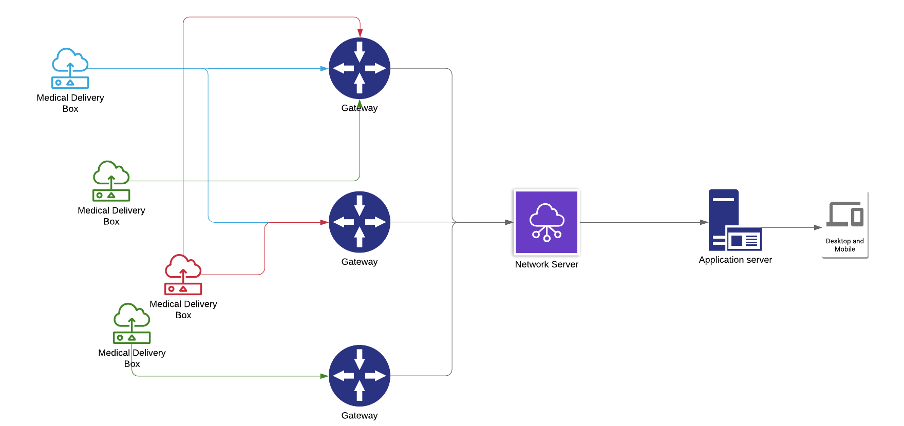

# Analyse

## Onderzoeksvraag

> Zijn producten nog bruikbaar na het transport door verschillende omstandigheden?  
> Hoe kunnen leveranciers weten dat ze tijdens transport moeten ingrijpen?  
> Wat moet er gebeuren indien producten onbruikbaar zijn geworden tijdens het transport?

## Voorstel tot oplossing

Medical delivery is een probleem in moeilijk bereikbare delen van de wereld. Er zijn veel omgevingen met schommelende temperaturen, van onder het nulpunt tot de brandende zon. Schokken tijdens het vervoeren van medische goederen kan de chemische structuur van de medicijnen aanpassen of andere pakketten onbruikbaar maken. Hierdoor bestaat er ook onzekerheid over herlevering.
Er is geen real-time informatie over de afstand en de staat van het product.

### Overzicht oplossing

Via real-time data kan men de locatie en de staat van het product nakijken. Een cross platform webapplicatie zal dit mogelijk maken. Indien een gebruiker het nodig acht om andere producten te laten brengen door een andere leverancier is dit mogelijk via de webapplicatie. De gebruiker zou de reeds bestelde producten kunnen annuleren indien deze niet meer aan de voorwaarden voldoen. Dan kan de transporteur terug gaan voor een nieuwe lading.

De mogelijkheid moet er ook zijn om alle producten onderweg op een kaart te zien, of de dozen in gebruik zijn en of deze aan het opladen zijn en waar deze gestockeerd staan. De hoeveelheid batterij resterend weergeven als je deze informatie opvraagt.

Per doos moeten er ook bepaalde specificaties ingesteld kunnen worden; bv. Hoeveel schokken kan deze doos aan, de maximum en minimum temperatuur, etc.

De leverancier moet producten kunnen kiezen welke hij meeneemt. Wanneer de leverancier een van de voorwaarden dreigt te overschrijden dient de webapplicatie op de smartphone/tablet een melding te geven zodat men hier tijdig op kan anticiperen.

#### Algemene architectuur

De verschillende boxen zullen als nodes werken en samen in een transportmiddel gestoken worden. Deze boxen sturen na een ingestelde tijdspanne data door indien er over de ingestelde grenzen is gegaan. De data wordt verstuurd naar LoRa Gateways. De sensor data die worden vergaard zijn oriëntatie, schokken, temperatuur, vochtigheid en positie. Aangezien het over afgelegen gebieden zou kunnen gaan waar geen LoRa gateway verbinding aanwezig zou zijn, kan er gebruikt gemaakt worden van een versterker zodat de reikwijdte vergroot wordt. De data zal gefilterd moeten worden via de end nodes zelf en enkel nodige data doorsturen.

## Detail analyse

### Smart Object

#### Blokdiagram

##### Specificatietabel

| Blok             | Specificatie | Min  | Nominaal | Max  |
| ---------------- | ------------ | ---- | -------- | ---- |
| RFM95W           | Werkspanning | 1.8V |          | 3.7V |
| Lithium batterij | Spanning     |      | 3.7V     |      |
|                  | Capaciteit   |      | 2000mAh  |      |
| Ultimate GPS Module| Werkspanning | 3.0V | 3.3V | 4.3V |
|                  | Stroomberbruik signal acquisition |  | 20mA |  |
|                  | Stroomberbruik tracking   |      | 25mA  |      |

##### Argumentatietabel

| Blok | Argumentatie | Alternatieven |
| ---- | ------------ | ------------- |
|      |              |               |
|      |              |               |

#### Elektrisch schema

#### State Diagram

#### Flowchart

### Front End

